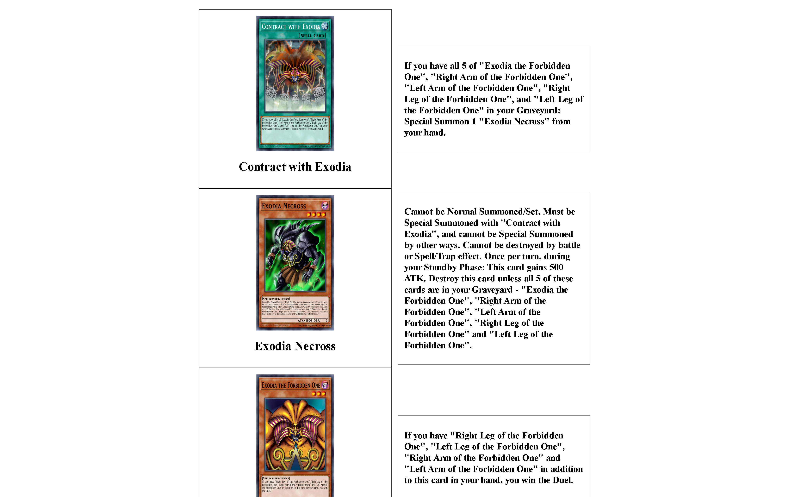

# 🃏 CharacterYuGiOh – Laravel 12 + Vite + API YGOProDeck



Este es un proyecto desarrollado con Laravel 12 en el backend y Vite en el frontend.
La aplicación consume la API pública de YGOProDeck para mostrar cartas de YU-GI-OH, incluyendo:

- Imagen

- Nombre

- Descripción

## Construido con 🛠️

✔️ `Laravel 12` framework que usa PHP para el backend.<br>
✔️ `Vite` para el frontend mostrar estilos.<br>
✔️ `PHP 8+` lenguaje de programación.<br>
✔️ `GuzzleHTTP` cliente para consumir APIs usando php.<br>
✔️ `Blade` motor de plantillas para Laravel.<br>
✔️ `Laravel Herd` proporciona: <br>
        - Servidor local integrado

        - PHP en múltiples versiones

        - Composer listo para usar

        - Gestión automática de sitios con dominios locales.

##  Partida 🚀
Asegurate de tener php y composer instalado, si no lo tienes puedes usar Laravel Herd.<bre>
Descargalo aqui: https://herd.laravel.com/docs/windows/getting-started/installation

1. Clona el repositorio
```
git clone https://github.com/Arm4nd7/Card-Monster-YU-GI-OH.git
```
2. Realiza 
```
composer install
composer  update
```
3. Realiza 
```
npm install
```
### Laravel herd
En el caso de que hayas instalado Laravel herd
1. inicializa el aplicativo lavael herd
2. crea el sitio en `sites/add`
4. Ahora esta listo abre el sitio que creo Laravel Herd y en tu ide de desarrollo inicia
```
npm run dev
```

### Si no usas Laravel herd
En este caso solo debes inicializar usando
```
php artisan serve
```
o
```
composer run dev
```

## Como funciona❓
El programa realiza una peticion GET a la API de [YU-GI-OH](https://db.ygoprodeck.com/api/v7/cardinfo.php).
Se mostrará
1. Imagen carta.
2. Nombre.
3. Descripción.

## 🏗️ Estrucutra
```
Card-Monster-YU-GI-OH/
├── app/                   # Lógica del Backend (Controladores, Modelos)
├── resources/             # Vistas de Blade y assets de Frontend
│   └── views/             # Archivos .blade.php
├── public/                # Assets compilados (CSS, JS) e imágenes
├── routes/                # Definición de rutas (web.php)
├── vendor/                # Dependencias de Composer
├── composer.json          # Dependencias de PHP
├── package.json           # Dependencias de Node (Vite)
└── README.md              # Documentación del proyecto
```

## Gratitud 🎁
* Gracias a [👀 YU-GI-OH API](https://ygoprodeck.com/api-guide/) para el uso de los datos.
* Gracias a [👀 Laravel Herd](https://herd.laravel.com/windows) para entorno de desarrollo agil.
* Gracias a [👀 Laravel Docs HTTP CLIENT](https://laravel.com/docs/12.x/http-client#main-content) para relizar peticiones.
* Gracias a [👀 Guzzle](https://docs.guzzlephp.org/en/stable/overview.html#installation) para relizar peticiones.


